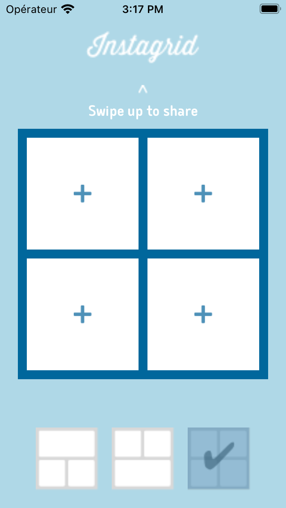
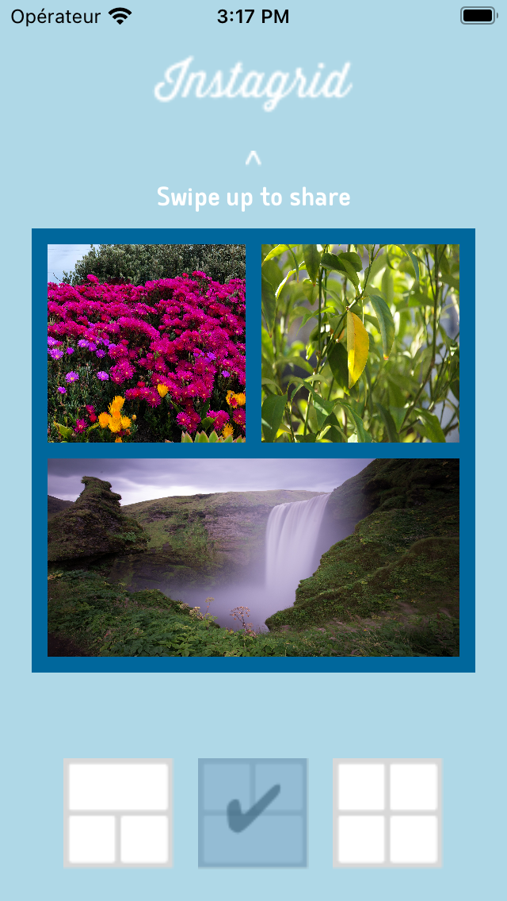
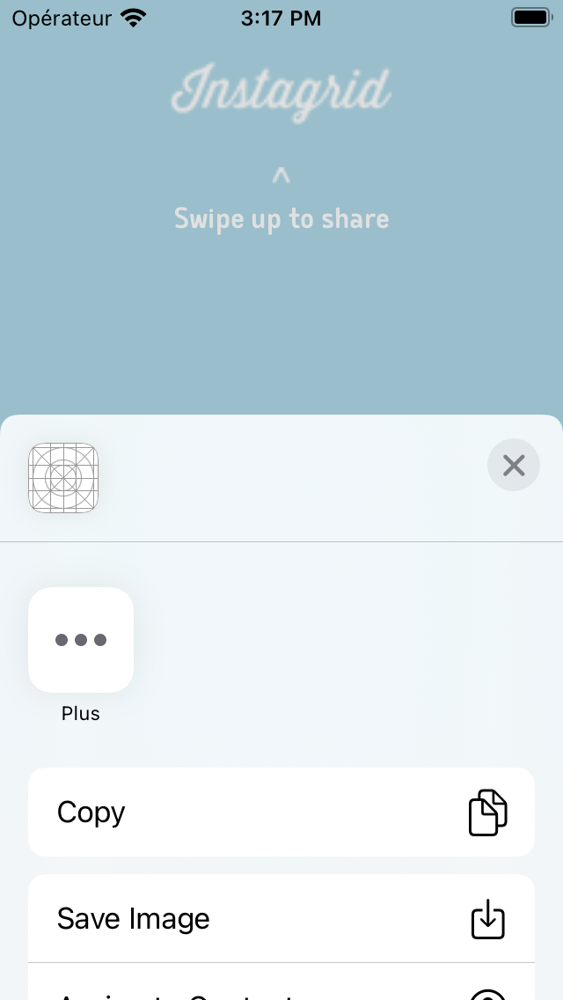

# Projet-4

Une application de montage photo 

Parcours Développeur d'application - iOS 

# Instagrid
This project is for my school OpenclassRooms

The application is a exercice for learn stackView, animation, use the library pictures user and share the creation

The application is used to :  
- Use library pictures of the user   
- Find layout for various picutures  
- Share the result   

 

